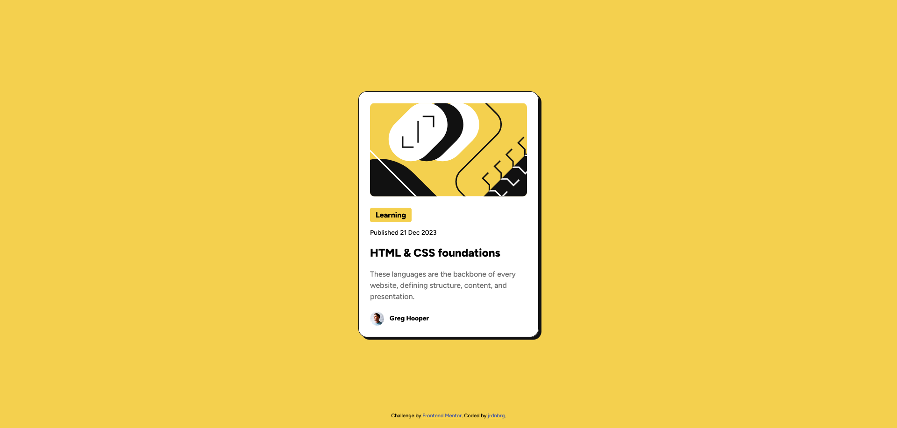

# Frontend Mentor - Blog preview card solution

This is a solution to the [Blog preview card challenge on Frontend Mentor](https://www.frontendmentor.io/challenges/blog-preview-card-ckPaj01IcS). Frontend Mentor challenges help you improve your coding skills by building realistic projects. 

## Table of contents

- [Overview](#overview)
  - [The challenge](#the-challenge)
  - [Screenshot](#screenshot)
  - [Links](#links)
- [My process](#my-process)
  - [Built with](#built-with)
  - [What I learned](#what-i-learned)
  - [Useful resources](#useful-resources)

## Overview

### The challenge

Users should be able to:

- See hover and focus states for all interactive elements on the page

### Screenshot

### Links

- Live Site URL: https://jrdnbrg.github.io/blog-preview-card/

## My process

### Built with

- Semantic HTML5 markup
- Flexbox

### What I learned

I learned about the difference between variable fonts and static fonts. I now know the advantages of using variable fonts and I will be using them going forward.

Besides, I focused on accessiblity and using the correct semantic HTML elements. I feel like I now have a better understanding of when to use certain elements.

### Useful resources

- [Introduction to variable fonts on the web](https://web.dev/articles/variable-fonts) - This helped me understand variable fonts.
- [Variable fonts guide](https://developer.mozilla.org/en-US/docs/Web/CSS/CSS_fonts/Variable_fonts_guide) - This helped me understand variable fonts.
- [The Article Contents element](https://developer.mozilla.org/en-US/docs/Web/HTML/Element/article) - This helped me better understand when to use the article element.
- [The (Date) Time element](https://developer.mozilla.org/en-US/docs/Web/HTML/Element/time) - This is helped me better understand when to use the time element.